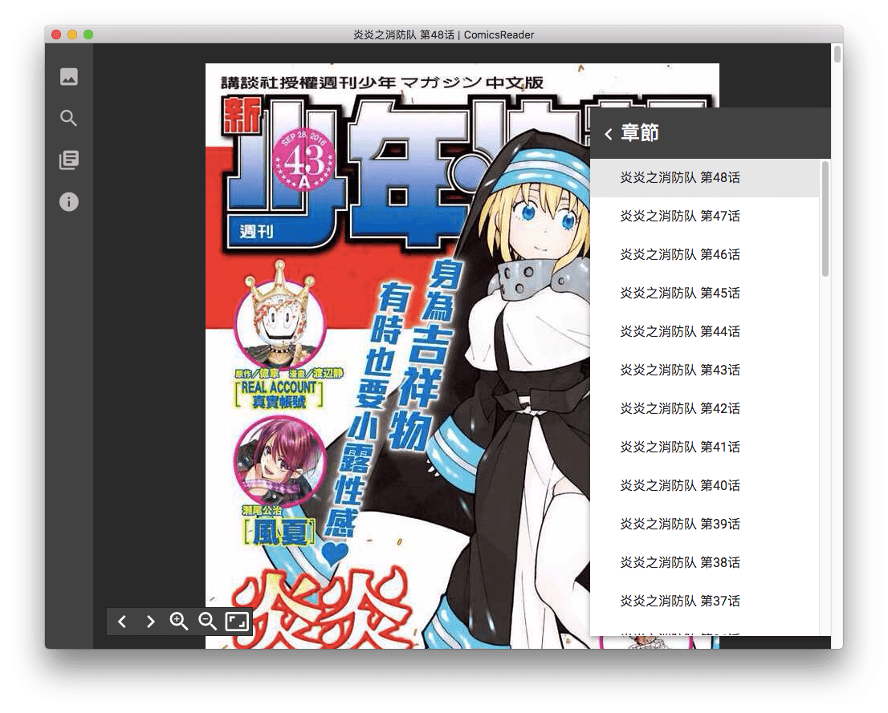

# Comics Reader


以 React/Redux/Electron 架構打造的漫畫閱讀器，可在各平臺（Windows/macOS/Linux/Chrome）使用。

## Preview




## Backend

* 漫畫源為[動漫屋](http://www.dm5.com)
* 你知道的 [Electron](http://electron.atom.io/)

其它文件陸續誕生中 😅

## Development

先把專案 clone 下來：

```bash
git clone https://github.com/ComicsReader/app
cd app

cp src/config.js.sample src/config.js
```

```bash
npm install
npm run dev # webpack watch build

# in a seperate tab
cd electron
npm install
npm run dev
```

## Build

```bash
npm install
npm run product

# in electron directory
cd electron
npm install
npm run dist
```

## Credits

fork 自 [zeroshine/ComicsScroller](https://github.com/zeroshine/ComicsScroller)，以此專案為基底打造。


## LICENSE

The MIT License (MIT)

Copyright (c) 2016 Yukai Huang

Permission is hereby granted, free of charge, to any person obtaining a copy of this software and associated documentation files (the "Software"), to deal in the Software without restriction, including without limitation the rights to use, copy, modify, merge, publish, distribute, sublicense, and/or sell copies of the Software, and to permit persons to whom the Software is furnished to do so, subject to the following conditions:

The above copyright notice and this permission notice shall be included in all copies or substantial portions of the Software.

THE SOFTWARE IS PROVIDED "AS IS", WITHOUT WARRANTY OF ANY KIND, EXPRESS OR IMPLIED, INCLUDING BUT NOT LIMITED TO THE WARRANTIES OF MERCHANTABILITY, FITNESS FOR A PARTICULAR PURPOSE AND NONINFRINGEMENT. IN NO EVENT SHALL THE AUTHORS OR COPYRIGHT HOLDERS BE LIABLE FOR ANY CLAIM, DAMAGES OR OTHER LIABILITY, WHETHER IN AN ACTION OF CONTRACT, TORT OR OTHERWISE, ARISING FROM, OUT OF OR IN CONNECTION WITH THE SOFTWARE OR THE USE OR OTHER DEALINGS IN THE SOFTWARE.
