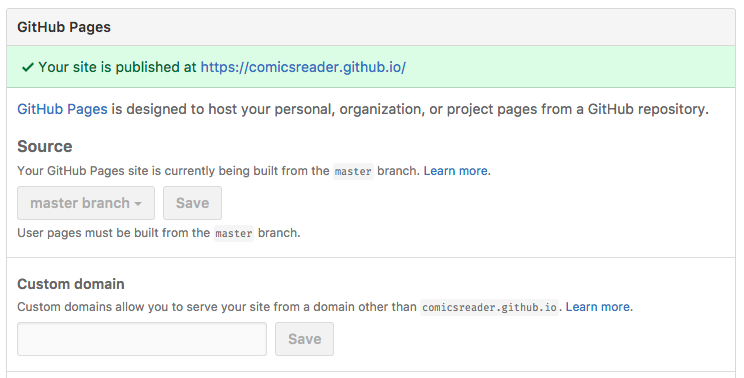

# ComicsReader Website

Built with [Jekyll](https://github.com/jekyll/jekyll).

## Development

Ensure you've already setup [ruby enviroment](https://www.ruby-lang.org) with [Bundler](https://github.com/bundler/bundler). For ruby version management, I'll recommend [rbenv](https://github.com/rbenv/rbenv).

```bash
bundle install
bundle exec jekyll serve
```

Then visit [http://localhost:4000](http://localhost:4000) to see the build result.

## Build

Git push to GitHub-hosted origin, and check the **GitHub Pages** in repository options.

Config **Source** to **master** branch.


